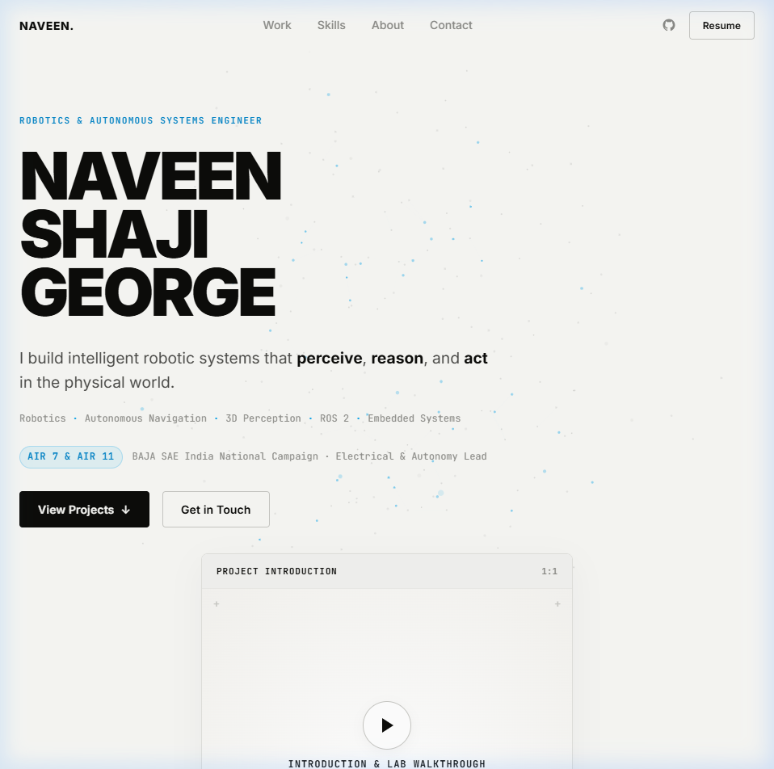
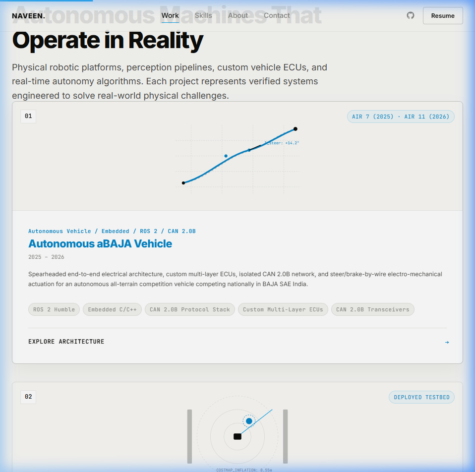
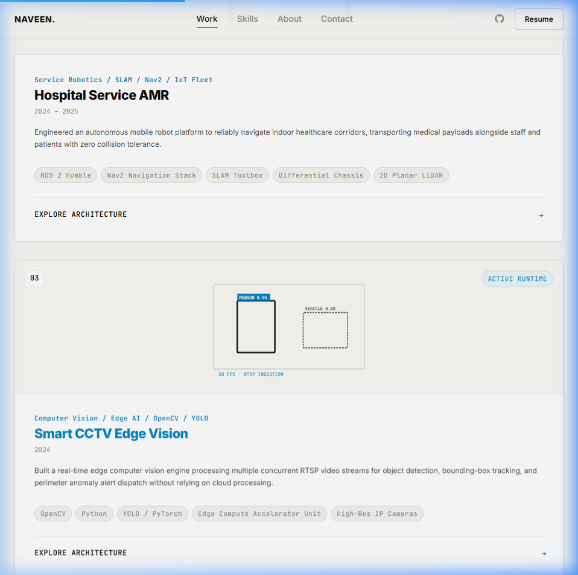
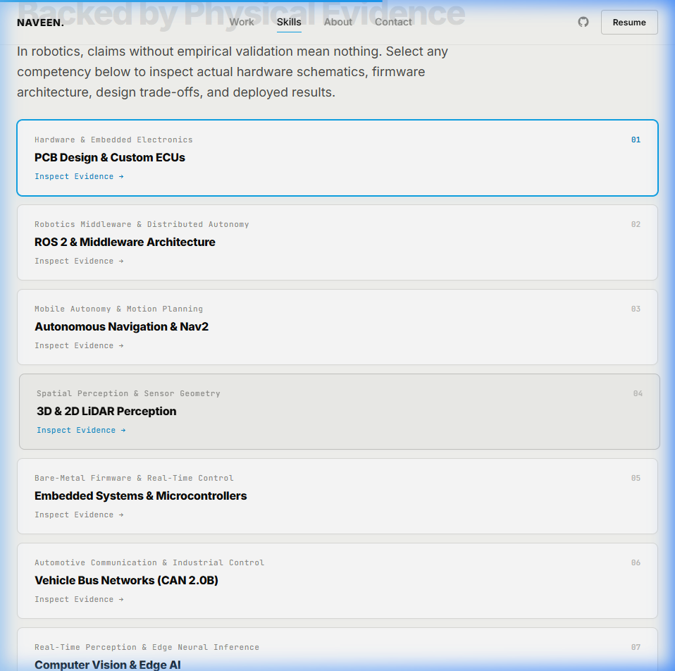
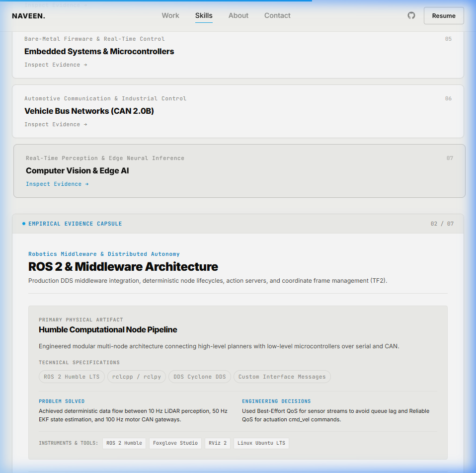
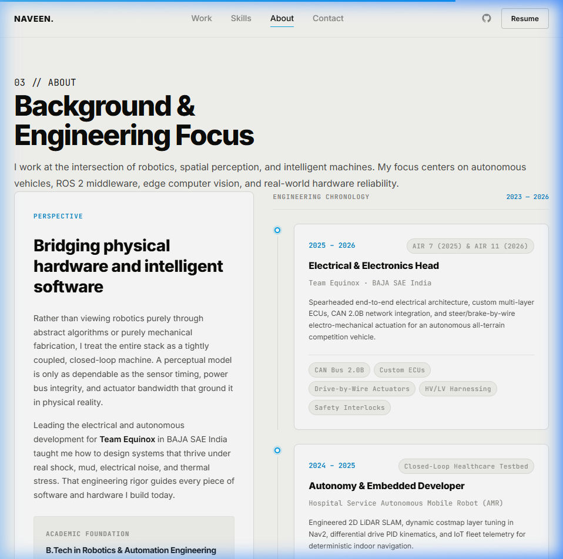
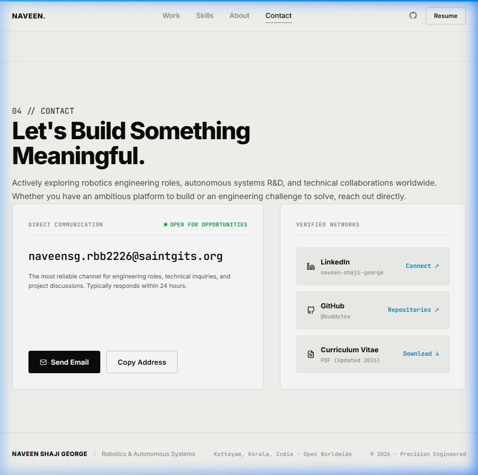
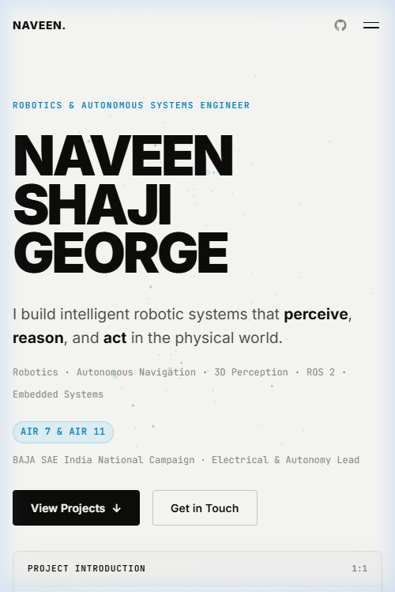

# Naveen Shaji George — Robotics Portfolio: Visual Showcase & Architecture Guide

A comprehensive architectural breakdown and visual showcase of the personal robotics and autonomous systems engineering portfolio for **Naveen Shaji George**.

---

## 1. High-Resolution Visual Gallery

### Hero Section (Desktop 1440×900)

*Monumental typography, concise robotics value proposition, and the 1:1 Video Placeholder Frame.*

---

### 01 // Selected Work Grid

*Selected Projects: Autonomous aBAJA Vehicle (AIR 7/11) and Hospital Service AMR with custom SVG domain signatures.*


*Smart CCTV Edge Vision (OpenCV/YOLO) and Swarm Robotics Platform (ESP32 Mesh).*

---

### 02 // Skills & Validation Evidence (Claim → Evidence)

*Interactive capability selector on the left paired with the live Empirical Evidence Capsule on the right.*


*Selecting ROS 2 swaps the active capsule to show the Humble Computational Node Pipeline, specs, problem solved, and decisions.*

---

### 03 // About & Engineering Chronology

*Interdisciplinary perspective, Saintgits B.Tech academic foundation, and verified engineering chronology (2023–2026).*

---

### 04 // Contact & Direct Verification

*Direct communication card with 1-click clipboard copy (`naveensg.rbb2226@saintgits.org`) and verified network links.*

---

### Mobile Viewport Stacking (390×844)

*Fluid single-column stacking ensuring large typography and touch-friendly interactive targets.*

---

## 2. Design Ethos & Visual Direction

### The "Editorial Light Canvas"
The website deliberately moves away from dark "sci-fi robot control HUD" tropes (neon green terminals, fake radar screens, simulated CPU gauges, and UTC clocks). Instead, it embraces an **editorial, research-publication aesthetic**:
- **Canvas**: Warm off-white (`#F8F8F5`) with crisp pure white card surfaces (`#FFFFFF`).
- **Typography**: Near-black (`#0C0C0A`) with subtle secondary grays (`#71717A` / `#A1A1AA`).
- **Restrained Cyan Accent**: Electric sky blue (`#0EA5E9`), used strictly for interactive states, active tab borders, and focus rings.
- **Hairline Geometry**: Razor-sharp `1px solid #E4E4E7` borders and precision corner aperture marks (`+`).

---

## 3. Core Component Architecture

```
src/
├── layouts/
│   └── Layout.astro            # Base shell, progress indicator & SpatialField canvas
├── components/
│   ├── Navigation.astro        # Sticky editorial top bar (Work, Skills, About, Contact, Resume)
│   ├── Hero.astro              # Monumental headline, intro statement, 1:1 video placeholder
│   ├── SpatialField.astro      # Site-wide interactive 3D point cloud & morphing engine
│   ├── ProjectIndex.astro      # 4 verified project cards with custom SVG domain signatures
│   ├── SkillsEvidence.astro    # Interactive competency selector + live Evidence Capsule
│   ├── About.astro             # Narrative bio, Saintgits B.Tech, timeline (2023–2026)
│   ├── Contact.astro           # Direct email with 1-click clipboard copy + verified networks
│   └── Footer.astro            # Minimal bottom colophon
├── data/
│   ├── projects.ts             # Authentic project specifications, pipelines, and results
│   └── skills.ts               # Competencies, empirical artifacts, and hardware trade-offs
└── pages/
    ├── index.astro             # Streamlined 4-stage homepage flow
    ├── projects/[id].astro     # Dynamic case studies (/projects/abaja, etc.)
    └── skills/[id].astro       # Dynamic evidence records (/skills/pcb-design, etc.)
```

---

## 4. Section Deep Dives

### A. Hero Section (`src/components/Hero.astro`)
1. **Monumental Name Typography**:
   - Three bold lines: `NAVEEN`, `SHAJI`, `GEORGE` rendered in heavy uppercase font weight (`font-weight: 900`, line height `0.88`, tracking `-0.05em`).
   - Acts as the primary visual anchor of the page.
2. **Immediate Engineering Value Proposition**:
   - Subtitle: `ROBOTICS & AUTONOMOUS SYSTEMS ENGINEER`
   - Statement: *"I build intelligent robotic systems that perceive, reason, and act in the physical world."*
   - Competencies: `Robotics · Autonomous Navigation · 3D Perception · ROS 2 · Embedded Systems`.
   - Verified Credential Badge: `AIR 7 & AIR 11 · BAJA SAE India National Campaign · Electrical & Autonomy Lead`.
3. **1:1 Video Placeholder Frame**:
   - Balanced 1:1 aspect ratio card (`max-width: 460px`) commanded by precision corner marks and a central play glyph.
   - **Auto-Detection Logic**: Houses a `<video id="introVideo" src="/video/introduction.mp4">`. If an MP4 file exists at `public/video/introduction.mp4`, it automatically hides the standby placeholder and plays the video on loop.

---

### B. Site-Wide Continuous Perception Field (`src/components/SpatialField.astro`)
- **Single Background Canvas**: Persistent fixed HTML5 canvas behind all sections (`z-index: 0`, `pointer-events: none`).
- **3D Perspective Projection**: Translates normalized 3D coordinates $(n_x, n_y, n_z)$ to screen space using focal-length scaling ($f = 380$).
- **Cursor Obstacle Physics**: When the cursor enters the viewport, points within $150\text{px}$ experience a physical deflection force:
  $$F = \left(1 - \frac{d}{150}\right)^{1.6} \times F_{\text{repel}}$$
  Points return smoothly via spring-damper equations ($k = 0.038$, $\text{damping} = 0.86$).
- **Continuous Scroll Morphing**:
  - **Hero**: Volumetric field framing the monumental name and 1:1 video.
  - **Work**: Particles stream downward and fan outward laterally to frame the 2-column project cards.
  - **Skills**: Particles condense into an interconnected coordinate grid echoing hardware traces and sensor nodes.
  - **About & Contact**: Particles gently settle into an ambient peripheral constellation.
- **Mobile & Accessibility Safeguards**: Automatically reduces point count from 240 to 85 on mobile, disables mouse listeners, and halts animation when `prefers-reduced-motion` is detected.

---

### C. Selected Work Section (`src/components/ProjectIndex.astro`)
Presents 4 authentic robotics engineering projects stored in `src/data/projects.ts`:
1. **Autonomous aBAJA Vehicle (AIR 7 & AIR 11)**: All-terrain drive-by-wire steering/braking, custom multi-layer ECUs, isolated CAN 2.0B bus. Visual signature shows steer-by-wire trajectory curve ($\delta_{\text{steer}} = +14.2^\circ$).
2. **Hospital Service AMR**: Autonomous indoor hospital transport, 360° planar LiDAR SLAM, dynamic Nav2 costmaps with inflation recovery. Visual signature shows radial LiDAR range rings and dynamic obstacle detection.
3. **Smart CCTV Edge Vision**: Real-time RTSP video ingestion, quantized YOLO object detection, and spatial anomaly tracking at sustained 30 FPS. Visual signature shows camera viewport and bounding boxes.
4. **Swarm Robotics Platform**: Decentralized multi-agent consensus, ad-hoc ESP32 TCP/IP wireless mesh. Visual signature shows peer-to-peer network topology links.

Each card links directly to dedicated deep-dive case studies at `/projects/[id]`.

---

### D. Skills & Validation Evidence Section (`src/components/SkillsEvidence.astro`)
Embodies the core robotics engineering principle: **CLAIM $\rightarrow$ EVIDENCE**:
- **Interactive Competency Objects (Left Column)**:
  - `01` PCB Design & Custom ECUs
  - `02` ROS 2 & Middleware Architecture
  - `03` Autonomous Navigation & Nav2
  - `04` 3D & 2D LiDAR Perception
  - `05` Embedded Systems & Microcontrollers
  - `06` Vehicle Bus Networks (CAN 2.0B)
  - `07` Computer Vision & Edge AI
- **Live Empirical Evidence Capsule (Right Column)**:
  - Instant client-side DOM swap without layout shifts or page reloads.
  - Displays the **Primary Physical Artifact** (e.g., *Custom Multi-Layer Vehicle ECU*, *Humble Computational Node Pipeline*).
  - Lists **Technical Specifications** (e.g., *4-Layer FR4, 120Ω differential termination, TVS ESD suppression*).
  - Outlines the **Problem Solved** and **Engineering Trade-Offs**.
  - Direct links to related systems and full evidence files at `/skills/[id]`.

---

### E. About Section (`src/components/About.astro`)
- **Engineering Perspective**: Articulates an interdisciplinary approach treating software algorithms, power buses, sensor timing, and mechanical actuators as a tightly-coupled, closed-loop machine.
- **Academic Foundation**: B.Tech in Robotics & Automation Engineering, Saintgits College of Engineering.
- **Engineering Chronology (2023–2026)**: Timeline nodes covering BAJA SAE Electrical & Autonomy Head, Hospital AMR Developer, and Swarm Robotics Researcher.
- **CV Action**: Prominent button to download `public/Naveen_Shaji_George_CV.pdf`.

---

### F. Contact Section (`src/components/Contact.astro`)
- Header: *"Let's Build Something Meaningful."*
- Direct email card featuring a live `● OPEN FOR OPPORTUNITIES` indicator.
- **1-Click Clipboard Copy**: Clicking `Copy Address` writes `naveensg.rbb2226@saintgits.org` to the clipboard with real-time feedback (*"Copied to Clipboard ✓"*).
- Verified Networks: Direct links to LinkedIn, GitHub (`@buddytex`), and Resume.

---

### G. Mobile Experience (390px Viewport)
- Fluidly reflows into a single-column layout without horizontal overflow.
- Clean hamburger drawer menu with high-contrast mobile links.
- 1:1 Video Frame and Project Cards maintain proper aspect ratios and touch-friendly target sizes ($\ge 44\text{px}$).

---

## 5. Development & Build Commands

```bash
# Start Astro development server
npm run dev

# Safe production build (sets RAYON_NUM_THREADS=2 for Windows VM)
npm run build

# Preview static build on port 4321
node scripts/serve.mjs
```

### Production Build Metrics
- **Build Duration**: $\sim 1.92$ seconds
- **Static Pages Generated**: 12 pages (`/index.html`, 4 project case studies, 7 skill evidence records)
- **Errors / Warnings**: 0
